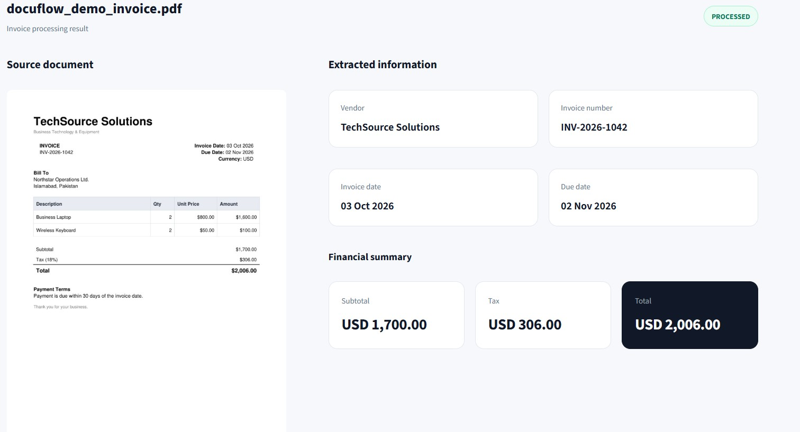
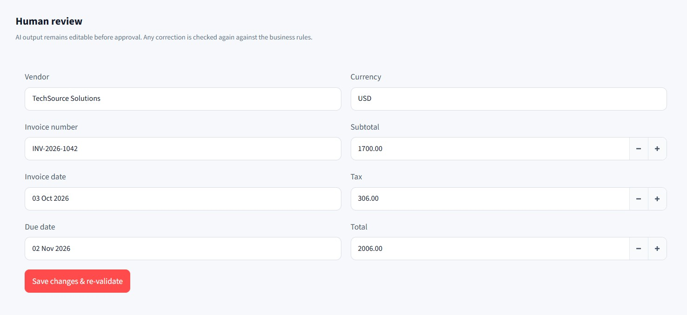
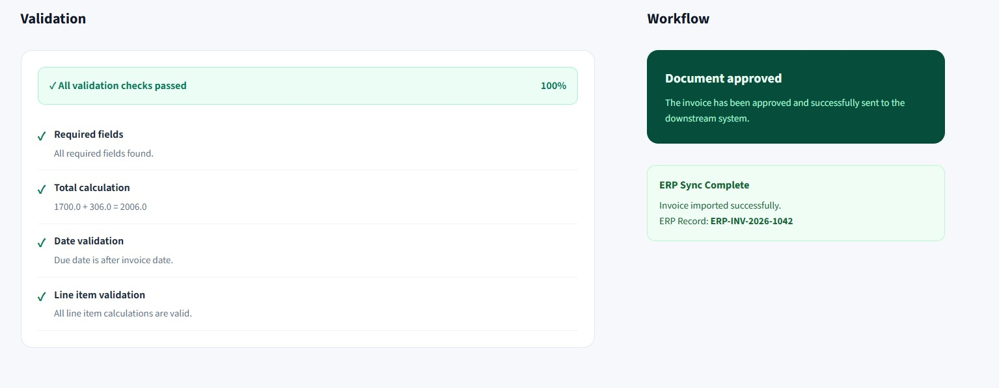

# DocuFlow AI

AI-powered invoice processing with automated extraction, validation, human review, and ERP integration.

## Overview

DocuFlow AI turns unstructured invoices into validated, structured data using Google Gemini. It combines AI extraction with deterministic business rules and a human-in-the-loop approval step before sending approved data to a downstream ERP system.

### Workflow

```text
Upload → AI Extraction → Validation → Human Review → Approval → ERP Sync
````

## Features

* Automatic invoice processing after upload
* AI-powered invoice data extraction with Google Gemini
* PDF and image document support
* Validation of required fields, totals, dates, and line items
* Human review and correction
* Automatic re-validation after corrections
* Mock ERP integration
* Processing activity tracking
* JSON export

## Screenshots

### Document Processing



### Human Review



### Validation & ERP Workflow



## Tech Stack

* **Frontend:** Streamlit
* **Backend:** FastAPI
* **AI:** Google Gemini
* **Validation:** Python / Pydantic
* **Document Processing:** PyMuPDF
* **API Communication:** REST / Requests

## Project Structure

```text
docuflow-ai/
├── backend/
│   ├── services/
│   │   ├── extraction.py
│   │   └── validation.py
│   ├── main.py
│   └── schemas.py
├── frontend/
│   └── app.py
├── data/
│   ├── uploads/
│   └── processed/
├── images/
│   ├── Document_upload.jpg
│   ├── Human_review.jpg
│   └── Validation.jpg
├── sample_documents/
│   └── docuflow_demo_invoice.pdf
├── .env.example
├── requirements.txt
└── README.md
```

## Setup

Clone the repository and create a virtual environment:

```bash
git clone <your-repository-url>
cd docuflow-ai

python -m venv .venv
.venv\Scripts\activate
```

Install dependencies:

```bash
pip install -r requirements.txt
```

Create a `.env` file:

```env
GEMINI_API_KEY=your_gemini_api_key
```

## Running

Start the FastAPI backend:

```bash
uvicorn backend.main:app --reload
```

In another terminal, start Streamlit:

```bash
streamlit run frontend/app.py
```

Open the Streamlit URL shown in the terminal.

## Validation

DocuFlow validates extracted invoice data before approval:

* Required fields
* Subtotal + tax = total
* Due date after invoice date
* Quantity × unit price = line-item amount

If a validation check fails, the document enters **Review**. Users can correct the extracted information and re-run validation before approval.

## Demo

A sample invoice is included in:

```text
sample_documents/docuflow_demo_invoice.pdf
```

The demo supports the complete workflow from invoice upload through validation, human approval, and mock ERP synchronization.

## Security

API keys are loaded through environment variables and should never be committed to the repository.

## Status

**MVP — Working prototype**
